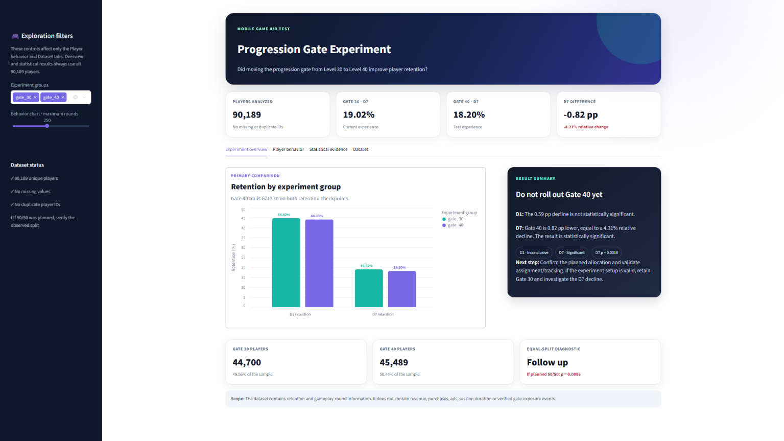

# Mobile Game A/B Testing

## Project overview

In this project, I analyzed a publicly shared player-level dataset presented as
a Cookie Cats A/B-test case study. The experiment tested whether moving a
progression gate from level 30 to level 40 changed player behavior and retention.

I chose this dataset because it provides a clear question with real player-level data. My aim was to follow a simple analysis process that I could explain from beginning to end: check the data, compare the groups, test the retention differences and make a recommendation based on the result.

## Dashboard preview

## Question

**Does moving the progression gate from level 30 to level 40 improve D1 or D7 player retention?**

## Dataset

The dataset contains 90,189 anonymized players and five columns:

| Column | Description |
|---|---|
| `userid` | Anonymous player ID |
| `version` | Experiment group: `gate_30` or `gate_40` |
| `sum_gamerounds` | Rounds played during the first 14 days |
| `retention_1` | Whether the player returned one day after installing |
| `retention_7` | Whether the player returned seven days after installing |

The public dataset is available in the [Cookie Cats A/B testing repository](https://github.com/ryanschaub/Mobile-Games-A-B-Testing-with-Cookie-Cats).

## What I did

1. Checked the required columns, missing values and duplicate player IDs.
2. Compared the number of players in the two experiment groups.
3. Examined the distribution of rounds played.
4. Calculated D1 and D7 retention for each group.
5. Measured the absolute and relative differences.
6. Used a two-group proportion test and a 95% confidence interval.
7. Saved the results as CSV tables and PNG charts.
8. Built a Streamlit dashboard to explore the groups and review the experiment result.
9. Turned the statistical result into a recommendation.

## Main results

| Metric | Gate 30 | Gate 40 | Difference | p-value |
|---|---:|---:|---:|---:|
| D1 retention | 44.82% | 44.23% | -0.59 percentage points | 0.0744 |
| D7 retention | 19.02% | 18.20% | -0.82 percentage points | 0.0016 |

The D1 difference is small and is not statistically significant at the 5% level.

The D7 retention rate is 0.82 percentage points lower in the Gate 40 group. This is a relative decline of about 4.31%, and the result is statistically significant.

I report both retention checkpoints without a multiple-testing adjustment. I
treat this as an exploratory analysis because the public source does not
identify a pre-registered primary outcome.

The observed D7 result does not support rolling out Gate 40. Before making a
production decision, I would confirm the planned group allocation and validate
the assignment and tracking setup. If those checks are clean, I would retain
Gate 30 and investigate why Gate 40 reduced D7 retention.

The observed split is 49.56% for Gate 30 and 50.44% for Gate 40. A 50/50
equal-split diagnostic gives p=0.0086. The public data does not state that the
planned allocation was 50/50, so this is a follow-up question rather than proof
of a faulty experiment. If the intended split was equal, I would verify the
assignment and tracking process before treating the result as production-ready.

## Limitations

The dataset does not include revenue, purchases, ads, session duration or exact gate-exposure events. For that reason, I do not make any claims about monetization or the reason behind the retention decline.

The available source is a public GitHub mirror, not the experiment's internal
design document. It does not provide the planned allocation, eligibility rules,
experiment dates, platform or country mix. I therefore present the causal
interpretation as conditional on the assignment and tracking setup being valid.

The result applies to this experiment and this game. It should not be treated as proof that the same gate position would work for another game.

The rounds variable contains one extreme value of 49,854. I keep the row in the
retention analysis, report the median alongside the mean and limit the behavior
chart range separately. This prevents a display choice from silently changing
the experiment sample.

## Project structure

~~~text
mobile-game-ab-testing/
├── data/
│   ├── cookie_cats.csv
│   └── README.md
├── .streamlit/
│   └── config.toml
├── outputs/
│   ├── 01_group_sizes.png
│   ├── 02_round_distribution.png
│   ├── 03_retention_comparison.png
│   ├── allocation_check.csv
│   ├── group_summary.csv
│   └── retention_test_results.csv
├── main.py
├── dashboard.py
├── tests/
│   ├── test_analysis.py
│   └── test_dashboard.py
├── requirements.txt
└── README.md
~~~

## Running the project in PyCharm

Tested on Windows with Python 3.11.

1. Download or clone the project.
2. Open the `mobile-game-ab-testing` folder in PyCharm.
3. Create a new virtual environment when PyCharm asks for an interpreter.
4. Open the PyCharm terminal.
5. Install the packages:

~~~bash
python -m pip install -r requirements.txt
~~~

6. Open `main.py`.
7. Right-click inside the file and select **Run 'main'**.

The script prints the findings in the Run window and creates the tables and charts inside the `outputs` folder.

## Running the dashboard

After installing the requirements, run this command in the PyCharm terminal:

~~~bash
python -m streamlit run dashboard.py
~~~

The dashboard opens in the browser. It includes:

- A structured experiment summary with clearly labeled KPI cards
- Interactive D1 and D7 retention comparison
- Experiment decision and statistical-status indicators
- Exploration controls that visibly update the Player behavior and Dataset tabs
- Normalized player-behavior distribution
- Confidence-interval visualization and result table
- Dataset preview and filtered CSV download

## Checking the analysis

I added automated checks for the dataset shape, group sizes, retention results,
equal-split diagnostic, dashboard-filter calculations and Streamlit control states:

~~~bash
python -m unittest discover -s tests
~~~

## Tools

- Python
- pandas
- Matplotlib
- Seaborn
- Streamlit
- Altair

## Author

Beyaz Karayılan

## Repository note

The dataset and generated outputs are included intentionally so the analysis can be reviewed immediately. PyCharm settings, virtual environments and temporary Python files are excluded through `.gitignore`.
